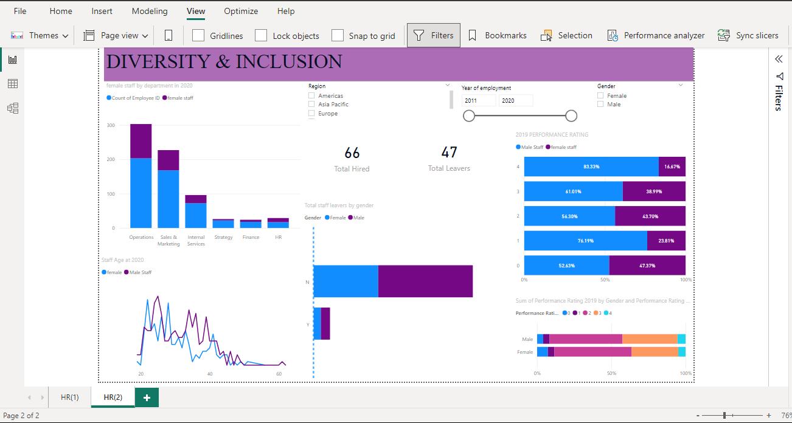
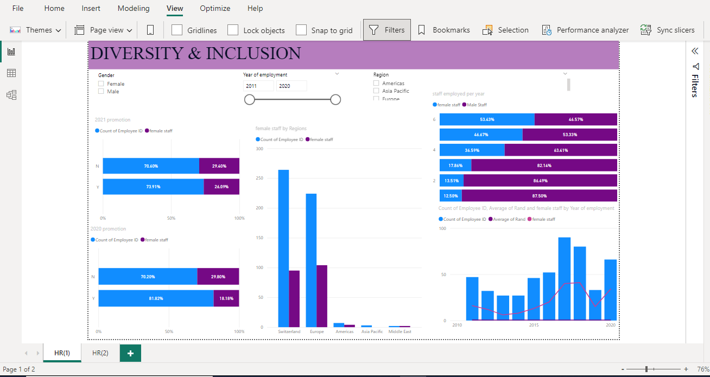

# DIVERSION & INCLUSION
## INTRODUCTION 
This is a Power BI project I worked on at the PwC Virtual Internship (Forage). A telecommunication company highly into diversity and inclusion is working hard to improve gender balance. The aim is to make all members of the team feel welcome and appreciated. 

## PROBLEM STATEMENT
To define relevant gender-related KPIs;
- The total new hire and those that left with gender comparison
- Performance rating 
- The yearly promotion
- Gender balance in the Executive? 
    
## SKILLS DEMONSTRATED IN POWER BI
Power Query, Data Cleaning, DAX, Data Visualization, Filters

## PROBLEM SOLVING & VISUALIZATION
- 61% of staff that left the company were females but only 34% of that vacant position were filled with that same female gender. 

- A view of the company's 2019 performance rating shows only 17% of the female had an excellent rating as compared to their male counterpart with 83%

 

- According to the promotion that occurred in 2021, 26% of the promoted staff were female, this increased when compared to the 18%  promoted in the previous year. 
 
- Just 13% of the total members of the executive were female

 ## CONCLUSION & RECOMMENDATIONS
The number of female staff in the non-executive arm of the company is on the lower side compared to those in the non-executive arm. 
The females staff was actually on the lower side but had a surge between 2016-2018 and then 2020.

## RECOMMENDATIONS 
Yearly performance review is recommended, when this is done, it could help decipher the reason towards the average performance of the female staff.
 
